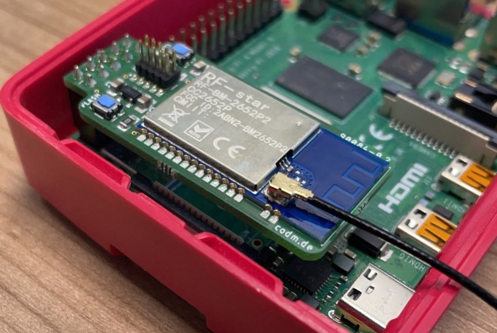

# cod.m ZigBee CC2652P Raspberry Pi module
[ZigBee CC2652 Raspberry Pi Coordinator](https://shop.codm.de/automation/zigbee/33/zigbee-cc2652p2-raspberry-pi-module) - a ZigBee Coordinator designed for the GPIO of the Raspberry Pi running Z-Stack Firmware 3.x - thanks to [Koenkk](https://github.com/Koenkk/).
The used CC2652P is the current generation of microcontrollers for ZigBee 3.x Coordinators and has an integrated power amplifier (+20dBm) for better coverage. 

According to [koenkk](https://github.com/Koenkk/Z-Stack-firmware/tree/master/coordinator) the CC2652 allows for up to 50 direct children and 100/200 routes directly on the coordinator. 
The size of a ZigBee mesh is not defined by the count of possible direct children at the coordinator, see https://www.zigbee2mqtt.io/information/FAQ.html#i-read-that-zigbee2mqtt-has-a-limit-of-20-devices-is-this-true

This module is the successor of our [CC2538 module](https://github.com/codm/cc2538-raspberry-pi-module). This time it is powered via the 5V rail of the Raspberry Pi with an LDO (Low Drop Out) voltage regulator. The CC2538 worked well on 3.3V directly but for the CC2652 we've decided to be not dependent on the internal voltage regulators of the Pi itself. 

You can buy a ready built coordinator, including external antenna at our webshop https://shop.codm.de/automation/zigbee/33/zigbee-cc2652p2-raspberry-pi-module or built on for non commercial use by yourself based on the files in this repository. Use the `bom.ulp` from Eagle to generate a parts list (BOM). 
If you can't get hold of the AP2112K you can also use an TLV75533P.

The 3D model of the RF-Star CC2652P could be found at GrabCad: https://grabcad.com/library/rf-star-cc2652p-module-1




# Running
To us the module directly on the serial interface on the GPIO of the Raspberry Pi, you have to free it up first. Either completely or by moving the Bluetooth UART to the mini-uart.
See https://www.raspberrypi.com/documentation/computers/configuration.html#configuring-uarts for a detailed explanation.

This is also explained in the manual (german): [Anleitung cod.m ZigBee CC2652 Raspberry Pi Modul](https://shop.codm.de/media/pdf/31/38/dd/20210427_ZigBee_CC2652_Raspberry_Pi_Modul_V02_Datenblatt_Anleitung-webnc4XN2YCGznNh.pdf)


If you want to use it with Home Assistant refer to this guide: https://github.com/MarijnPessers/cod.m-CC2538-CC2592-for-Home-Assistant

## zigbee2mqtt
Edit `data/configuration.yaml` accordingly: 

```
serial:
  port: /dev/ttyAMA0
  advanced: 
    baudrate: 115200 
    rtscts: false
```

## Homegear
Install `homegear-zigbee` and edit `/etc/homegear/families/zigbee.conf`: 

```
[Serial]
id = CC2652 
deviceType = serial

#use your own 16 bytes hexadecimal key! 
password = AABBCCDDEEFF11223344556677889900

device = /dev/ttyAMA0
```
Don't forget to comment in the `[]` block.


# Antenna
We recommend to use only external antennas as the module is close to the WiFi and Bluetooth module/antenna on the Raspberry Pi. But if you want to use the attached PCB antenna, rotate the resistor pointing to the u.FL socket by 90° so it connects the PCB trace.

# Firmware
We use Koenkk's Z-Stack 3.x Coordinator Firmware from https://github.com/Koenkk/Z-Stack-firmware/tree/master/coordinator/Z-Stack_3.x.0/bin, ZigStar Variant as it uses the same RF-BM-2652P2.

You can flash the firmware either by JTAG or directly from the Raspberry Pi using [cc2538-prog](https://github.com/1248/cc2538-prog/) - despite the name it also works with the CC2652.
The firmware has the needed serial bootloader enabled.

## JTAG
The 2x05 header is following the common [JTAG-Cortex-M0](https://www.segger.com/products/debug-probes/j-link/accessories/adapters/9-pin-cortex-m-adapter/) Layout.

Use `CC2652R1F` and `JTAG`@4000kHz.


## Serial via GPIO

### cc2538-bsl (preferred)
Install python3 if not alreay present with `sudo apt update && sudo apt-get install python3-pip` and install the needed python libraries `sudo pip3 install pyserial intelhex`.

Download or checkout [cc2538-bsl](https://github.com/JelmerT/cc2538-bsl) into a directory. After that download and extract the wanted coordinator firmware from [https://github.com/Koenkk/Z-Stack-firmware/tree/develop/coordinator/Z-Stack_3.x.0/bin](https://github.com/Koenkk/Z-Stack-firmware/tree/master/coordinator/Z-Stack_3.x.0/bin) - for the cod.m CC2652 Raspberry Pi module you'll need `CC1352P2_CC2652P_launchpad_*.zip` as listed on Koenkk's GitHub.

Please check that you zigbee software is not running anymore an nothing is accessing the serial device where the zigbee module is plugged in (`/dev/ttyAMA0`).

While connected and powered through the Pi, hold down the flash button on the module and press reset shortly while still holding flash. The CC2652 should now be in the bootloder.

To flash type `python3 cc2538-bsl.py -p /dev/ttyAMA0 -evw CC1352P2_CC2652P_launchpad_coordinator_20211217.hex` in the appropriate directory. Change the filename of the .hex-file accordingly.

The output looks something like this: 
```
pi@zigbee:~/cc2538-bsl $ python3 cc2538-bsl.py -evw -p /dev/ttyAMA0 ../CC1352P2_CC2652P_launchpad_coordinator_20211217.hex 
Opening port /dev/ttyAMA0, baud 500000
Reading data from ../CC1352P2_CC2652P_launchpad_coordinator_20211217.hex
Your firmware looks like an Intel Hex file
Connecting to target...
CC1350 PG2.0 (7x7mm): 352KB Flash, 20KB SRAM, CCFG.BL_CONFIG at 0x00057FD8
Primary IEEE Address: 00:12:4B:00:25:8F:18:32
    Performing mass erase
Erasing all main bank flash sectors
    Erase done
Writing 360448 bytes starting at address 0x00000000
Write 104 bytes at 0x00057F980
    Write done                                
Verifying by comparing CRC32 calculations.
    Verified (match: 0xba5c19c5)
```

After that hit the reset button on the module and start your zigbee software again. Maybe you have to replug the module or powercycle the pi.

Thanks to Alex for the documentation of that way.
Alternatively you can use https://github.com/electrolama/llama-bsl but I did not test this yet.

### cc2538-prog
Install and compile [cc2538-prog](https://github.com/1248/cc2538-prog/).

While connected and powered through the Pi, hold down the `flash` button on the module and press `reset` shortly while still holding `flash`. The CC2652 should now be in the bootloder.

Then execute `./cc2538-prog -d /dev/ttyAMA0 -f CC1352P2_CC2652P_launchpad_coordinator_20210120.hex `

The output should look like this: 
```
ping ok
Bootloader detected
Erasing page 0
Erasing page 1
[...]
Erasing page 254
Erasing page 255
Writing 16 bytes to 0x00200000
Writing 16 bytes to 0x00200010
[...]
Writing 16 bytes to 0x0023C7F0
Writing 12 bytes to 0x0027FFD4
```

After that reset the module using the corresponding button. 
It happened sometimes that I had to replug the module to get it to work again. 


# Thanks
* @koenkk Z-Stack Firmware - https://github.com/Koenkk/Z-Stack-firmware
* @1248 cc2538-prog - https://github.com/1248/cc2538-prog/

# License
[CC-BY-NC-SA 3.0](https://creativecommons.org/licenses/by-nc-sa/3.0/)

cod.m GmbH, Patrik Mayer, 2021
